<p align="center">
  
</p>

# Mergen-21: Low-Cost 21 cm Hydrogen Line Radio Telescope

A low-cost radio telescope system for observing the 21 cm hydrogen emission line (1420.405 MHz), designed and built as an EE401 graduation project at Ozyegin University.

**Primary science goal:** Mapping the Milky Way's galactic rotation curve via the tangent-point method from Istanbul, Turkey.

## System Overview


### Antenna
- **Measured S11:** -42 dB @ 1.4204 GHz (exceptional impedance match; fabrication exceeded simulation)
- **Simulated S11:** ~-30 dB near 1.40 GHz (CST Studio Suite full-wave EM)
- **Type:** Pyramidal horn antenna
- **Design frequency:** 1420.405 MHz (HI 21 cm line)
- **Material:** Sheet-metal aluminum (1.5 mm), laser-cut & riveted
- **Directivity:** 16.9 dBi at 1.42 GHz
- **3 dB beamwidth:** 22.0 deg (phi=90 deg), 25.2 deg (phi=0 deg)

### RF Chain
| Stage | Component | Function | Gain (dB) | NF (dB) | OIP3 (dBm) |
|-------|-----------|----------|-----------|---------|-------------|
| 1 | ZX60-P162LN+ | Low-noise amplifier (LNA) | 19.7 | 0.7 | +29.8 |
| 2 | ZX75BP-1450-S+ | Bandpass filter (1450 MHz center, ~50 MHz passband) | -0.8 (IL) | 0.8 (= IL) | N/A |
| 3 | ZX60-V63+ | Second-stage amplifier | 20.8 | 3.7 | +32.2 |
| **Cascade** | **LNA + BPF + Amp** | **Full receive chain** | **39.7 (meas.)** | **0.75 (meas.)** | **+29.5 (meas.)** |

### Backend
- **SDR:** ADALM-PLUTO SDR
- **Software:** GNU Radio for signal acquisition and processing
- **Analysis:** Python (NumPy, SciPy, Matplotlib, Astropy)

### Mechanical
- Horn antenna fabricated from laser-cut aluminum sheet metal
- Waveguide-to-coax transition with N-type connector
- 3D-printed tripod adapter
- CAD: Autodesk Inventor

## Project Status

| Component | Status | Notes |
|-----------|--------|-------|
| Hardware (antenna, RF chain, LDO) | Complete | Fully characterized; measurement data available |
| Power supply board | Complete | Gerbers ready; BOM in hardware/ldo-regulator/bom.pdf |
| Simulations (CST, AWR) | Complete | Exported results in hardware/simulation/ |
| Measurements (VNA, IP3, NF) | Complete | 39.7 dB gain, 0.75 dB NF, OIP3 +29.5 dBm (cascade) |
| GNU Radio flowgraphs | In Progress | Core acquisition flowgraph designed; testing ongoing |
| Analysis software | In Progress | Core calibration & rotation curve extraction in development |
| First-light observations | Pending | Awaiting software completion & weather window |
| Open-source release | Pending | After initial observations; git history cleanup planned |

## Key Results & Specifications

### RF Receiver Performance
- **Cascade gain:** 39.7 dB (measured @ 1.42 GHz via ZNB8)
- **Cascade NF:** 0.75 dB (measured output noise, agrees with theory to 0.19 dB)
- **Cascade OIP3:** +29.54 dBm (-12 dBm tone input; TOI spread 0.3 dB)
- **All measurements:** Traceable to R&S ZNB8 VNA & FSVA3044 spectrum analyzer

### Antenna Performance
- **Measured S11:** -42 dB @ 1.4204 GHz (exceptional; exceeds simulation)
- **Simulated directivity:** 16.9 dBi
- **3 dB beamwidth:** ~23 deg (H-plane & E-plane similar due to square waveguide)
- **Material:** 1.5 mm aluminum sheet; laser-cut 

### System Temperature & Sensitivity
- **System temperature:** ~30-40 K (sky + ground + receiver near zenith)
- **Minimum detectable signal (MDS):** ~-150 dBm @ 1 MHz BW (conservative)
- **Integration time for 1-sigma detection:** ~30 sec for typical HI brightness

## Repository Structure

```
mergen-21/
├── hardware/                    # All completed hardware (antenna, RF, power, sims)
│   ├── antenna/                 # Horn antenna: CAD, drawings, DXF, STL, photos
│   ├── rf-chain/                # Component datasheets & manufacturer S-parameters
│   ├── ldo-regulator/           # Dual LDO power supply (Altium, Gerbers, BOM, STEP)
│   └── simulation/              # CST antenna sims & AWR cascade analysis
├── measurements/                # Lab characterization data
│   ├── rf-chain/vna/            # VNA-measured S-parameters (R&S ZNB8)
│   ├── rf-chain/ip3/            # IP3 / intermodulation measurements
│   ├── rf-chain/nf/             # Noise figure measurements
│   ├── extras/                  # Test components (attenuators, 50 ohm matches)
│   └── antenna/                 # Horn antenna S11 & defect documentation
├── software/                    # Data acquisition & analysis (active development)
│   ├── gnuradio/                # GNU Radio flowgraphs (.grc)
│   ├── analysis/                # Python observation analysis scripts
│   └── python-scripts/          # Utility scripts
├── observations/                # Raw data & plots (awaiting first-light)
└── docs/                        # Build log, status, logo, diagrams
```

## Quick Navigation

- **First time here?** Start with [System Overview](#system-overview) above
- **Measurement data?** See [`measurements/`](measurements/)
- **Hardware files?** All under [`hardware/`](hardware/) — antenna CAD, RF chain, LDO board, simulations
- **Running observations?** GNU Radio flowgraphs in [`software/gnuradio/`](software/gnuradio/)
- **Current completion status?** See [`docs/STATUS.md`](docs/STATUS.md)

## Getting Started

### Prerequisites
- **GNU Radio 3.10+** with PlutoSDR source block (gr-iio)
- **Python 3.8+** with: `numpy`, `scipy`, `matplotlib`, `astropy`

> **Note:** CST Studio Suite, AWR Microwave Office, and Autodesk Inventor are only needed to re-run simulations or edit CAD files. The repo contains all exported results (S-parameters, STEP files, Gerbers, PDFs).

### Quick Start
```bash
git clone https://github.com/AlpGoXd/mergen-21.git
cd mergen-21
pip install -r software/requirements.txt
```

## Observation Site
- **Location:** Istanbul, Turkey (~41.0 deg N, 29.0 deg E)
- **Target:** Galactic plane HI emission at various galactic longitudes
- **Method:** Tangent-point method for rotation curve extraction

## Licensing
- **Hardware** (antenna, mechanical, RF chain designs): [CERN Open Hardware Licence Version 2 -- Strongly Reciprocal (CERN-OHL-S v2)](LICENSE-HARDWARE)
- **Software** (GNU Radio flowgraphs, Python scripts): [GNU General Public License v3.0 (GPL-3.0)](LICENSE-SOFTWARE)
- **Documentation & Photos:** [CC BY-SA 4.0](LICENSE-DOCS)

## Why "Mergen"?

Mergen is a figure from Turkic mythology associated with wisdom, insight, and precision. The name is also connected with the idea of a skilled marksman or archer, symbolizing accurate targeting and clear perception. For a 21 cm radio telescope, Mergen-21 reflects the project's aim of carefully observing the sky with precision in search of knowledge.

## Acknowledgments
- **Inspired by:** Open-source radio astronomy projects and the amateur radio community
- **PICTOR project:** [0xCoto/PICTOR](https://github.com/0xCoto/PICTOR) — reference implementation for radio astronomy data acquisition and analysis

## Author
**Alp Gokalp** -- Electrical & Electronics Engineering, Ozyegin University (Class of 2026)
