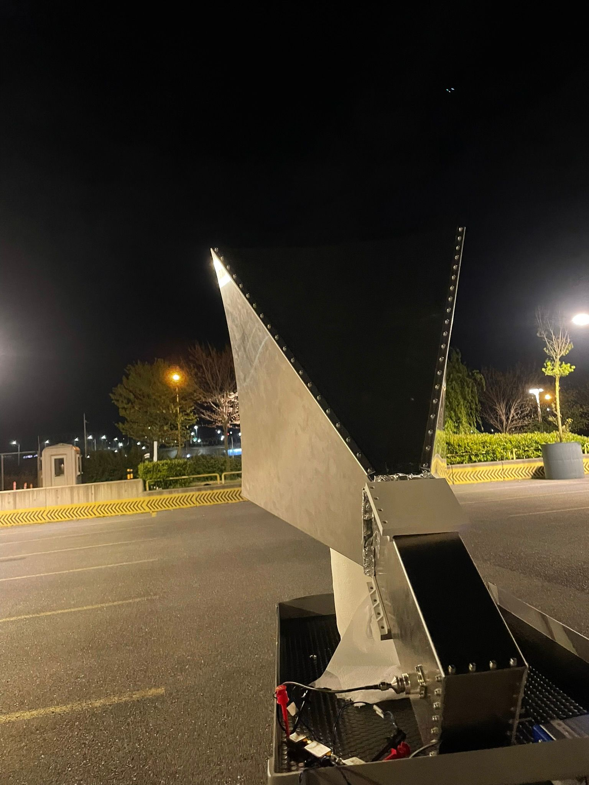
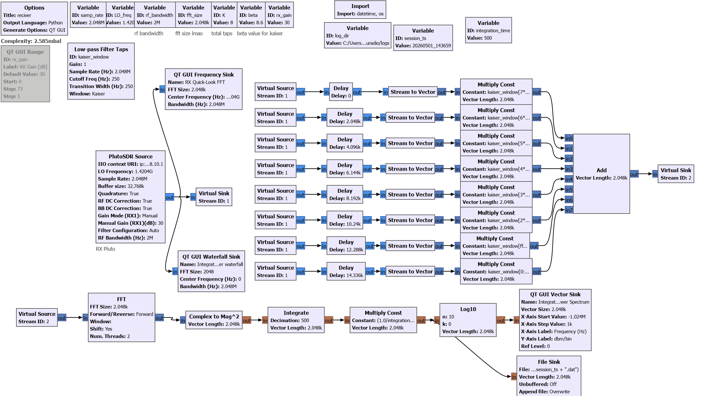

<p align="center">
  
</p>

# Mergen-21: Low-Cost 21 cm Hydrogen Line Radio Telescope

A radio telescope I built for my EE401 graduation project at Ozyegin University. It listens at 1420.405 MHz — the hydrogen line — and I used it to map how fast different parts of the Milky Way are rotating.

**Science goal:** Galactic rotation curve via the tangent-point method, observed from Istanbul, Turkey.

---

## System Overview




### Antenna
- **Type:** Pyramidal horn, 1.5 mm aluminum sheet, laser-cut & riveted
- **Design frequency:** 1420.405 MHz (HI 21 cm line)
- **Measured S11:** -42 dB @ 1.4204 GHz (exceeded simulation by a lot)
- **Simulated S11:** ~-30 dB near 1.40 GHz (CST Studio Suite)
- **Directivity:** 16.9 dBi at 1.42 GHz
- **3 dB beamwidth:** 22.0° (H-plane), 25.2° (E-plane)

### RF Chain
| Stage | Component | Function | Gain (dB) | NF (dB) | OIP3 (dBm) |
|-------|-----------|----------|-----------|---------|-------------|
| 1 | ZX60-P162LN+ | LNA | 19.7 | 0.7 | +29.8 |
| 2 | ZX75BP-1450-S+ | Bandpass filter (~50 MHz passband @ 1450 MHz) | -0.8 | 0.8 | N/A |
| 3 | ZX60-V63+ | Second amplifier | 20.8 | 3.7 | +32.2 |
| **Cascade** | **LNA + BPF + Amp** | | **39.7 (meas.)** | **0.75 (meas.)** | **+29.5 (meas.)** |

### Backend
- **SDR:** ADALM-PLUTO
- **Software:** GNU Radio for signal acquisition
- **Analysis:** Python (NumPy, SciPy, Matplotlib, Astropy)

Here's what the GNU Radio receiver flowgraph looks like:



### Mechanical
- Horn antenna from laser-cut aluminum sheet metal
- Waveguide-to-coax transition with N-type connector
- A 3D-printed tripod adapter was designed (files in `hardware/antenna/3d-print/`) but the mount did not work out in practice and wasn't used for observations

---

## Project Status

| Component | Status | Notes |
|-----------|--------|-------|
| Hardware (antenna, RF chain, LDO) | Complete | Fully characterized; measurement data available |
| Power supply board | Complete | Gerbers ready; BOM in `hardware/ldo-regulator/bom.pdf` |
| Simulations (CST, AWR) | Complete | Exported results in `hardware/simulation/` |
| Measurements (VNA, IP3, NF) | Complete | 39.7 dB gain, 0.75 dB NF, OIP3 +29.5 dBm (cascade) |
| GNU Radio flowgraphs | Complete | `reciver.grc` (main) + `21cm synth/` test flowgraphs |
| Analysis software | In Progress | Waterfall viewer done; full calibration pipeline in development |
| First-light observations | Complete | Directional sweeps 2026-04-29; data in `observations/data/` |
| Open-source release | In Progress | Final cleanup underway |

---

## Key Results

### RF Receiver
- **Cascade gain:** 39.7 dB (measured @ 1.42 GHz via ZNB8)
- **Cascade NF:** 0.75 dB (measured; agrees with theory to 0.19 dB)
- **Cascade OIP3:** +29.54 dBm (-12 dBm tone input; TOI spread 0.3 dB)
- Measurements traceable to R&S ZNB8 VNA & FSVA3044 spectrum analyzer

### Antenna
- **Measured S11:** -42 dB @ 1.4204 GHz
- **Simulated directivity:** 16.9 dBi
- **3 dB beamwidth:** ~23° (H-plane & E-plane similar due to square waveguide)
- Material: 1.5 mm aluminum sheet, laser-cut

### System Sensitivity
- **System temperature:** ~30–40 K (sky + ground + receiver near zenith)
- **MDS:** ~-150 dBm @ 1 MHz BW (conservative)

---

## Repository Structure

```
mergen-21/
├── hardware/                    # All hardware (antenna, RF chain, power, sims)
│   ├── antenna/                 # Horn: CAD, drawings, DXF, STL, photos
│   ├── rf-chain/                # Component datasheets & S-parameters
│   ├── ldo-regulator/           # Dual LDO board (Altium, Gerbers, BOM, STEP)
│   └── simulation/              # CST antenna sims & AWR cascade analysis
├── measurements/                # Lab characterization data
│   ├── rf-chain/vna/            # VNA S-parameters (R&S ZNB8)
│   ├── rf-chain/ip3/            # IP3 / intermodulation
│   ├── rf-chain/nf/             # Noise figure
│   └── antenna/                 # Horn S11 & manufacturing notes
├── software/                    # Data acquisition & analysis
│   ├── gnuradio/                # GNU Radio flowgraphs (.grc)
│   └── analysis/                # Python scripts (waterfall viewer, etc.)
├── observations/                # First-light data & plots (2026-04-29)
│   ├── data/                    # Raw spectra (.dat, NumPy float32)
│   └── plots/                   # Waterfall & sweep plots
└── docs/                        # Build log, status, diagrams
```

## Quick Navigation

- **Measurement data?** → [`measurements/`](measurements/)
- **Hardware files?** → [`hardware/`](hardware/) — antenna CAD, RF chain, LDO, sims
- **First-light data?** → [`observations/`](observations/) — raw spectra + plots
- **Running observations?** → [`software/gnuradio/`](software/gnuradio/) — flowgraphs + setup
- **Build progress?** → [`docs/STATUS.md`](docs/STATUS.md)

---

## Getting Started

```bash
git clone https://github.com/AlpGoXd/mergen-21.git
cd mergen-21
pip install -r software/requirements.txt
```

**Dependencies:**
- GNU Radio 3.10+ with PlutoSDR block (gr-iio)
- Python 3.8+ — `numpy`, `scipy`, `matplotlib`, `astropy`

> CST, AWR, and Autodesk Inventor are only needed to re-run simulations or edit CAD. All exported results (S-parameters, STEP, Gerbers, PDFs) are already in the repo.

---

## Observation Site

- **Location:** Istanbul, Turkey (~41.0°N, 29.0°E)
- **Target:** Galactic plane HI emission at various galactic longitudes
- **Method:** Tangent-point method for rotation curve extraction

---

## Licensing

- **Hardware** (antenna, mechanical, RF chain): [CERN-OHL-S v2](LICENSE-HARDWARE)
- **Software** (GNU Radio, Python): [GPL-3.0](LICENSE-SOFTWARE)
- **Documentation & Photos:** [CC BY-SA 4.0](LICENSE-DOCS)

---

## Why "Mergen"?

Mergen is a figure from Turkic mythology — associated with wisdom, precision, and skilled targeting. Felt like the right name for a telescope.

## Acknowledgments

- [PICTOR project](https://github.com/0xCoto/PICTOR) — reference for radio astronomy data acquisition

## Author

**Alp Gokalp** — Electrical & Electronics Engineering, Ozyegin University (Class of 2026)
