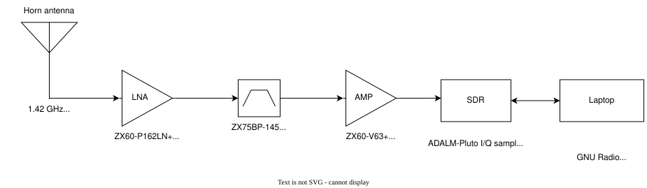
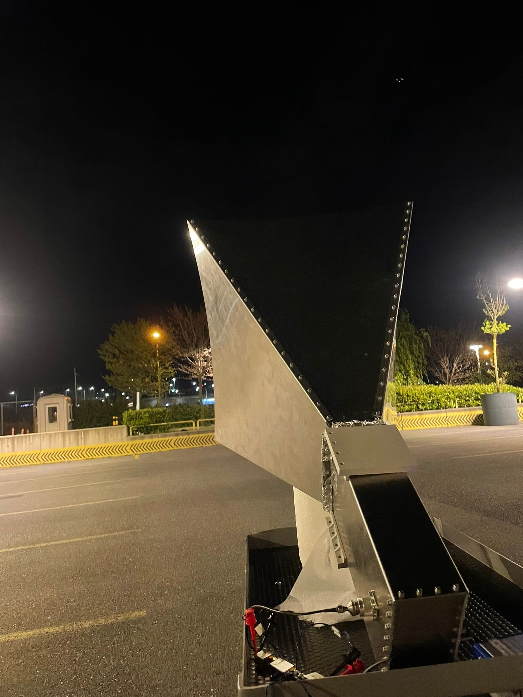
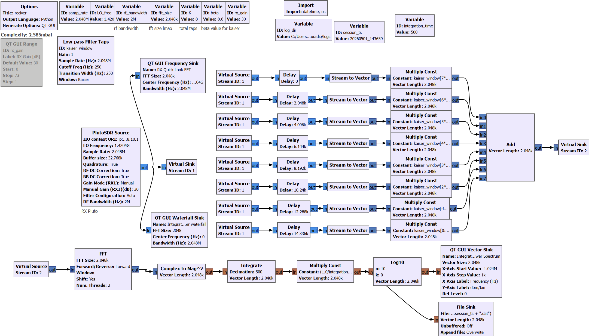

<p align="center">
  
</p>

# Mergen-21: Low-Cost 21 cm Hydrogen Line Radio Telescope

A radio telescope I built for my EE401 graduation project at Ozyegin University. It listens at 1420.405 MHz (the hydrogen line), and I used it to detect hydrogen emission from the Milky Way at several pointings. Mapping its rotation is future work.

**Science goal (future work):** a Galactic rotation curve via the tangent-point method, observed from Istanbul, Turkey. The released results are first-light hydrogen-line detections with pointing dependence (south/east/west); velocity/rotation-curve analysis is not yet complete (see "Reproducing the paper" below).

---

## System Overview





### Antenna
- **Type:** Pyramidal horn, 1.5 mm aluminum sheet, laser-cut & bolted (M3, see ASSEMBLY.md)
- **Design frequency:** 1420.405 MHz (HI 21 cm line)
- **Measured S11:** better than −30 dB from 1410 to 1440 MHz (ZNB8, 10 MHz grid; −41.8 dB at the 1420.000 MHz sample, so the null depth is not resolved)
- **Simulated S11 (CST Studio Suite):** ideal model −19.7 dB at 1420 MHz (minimum −30.7 dB at 1396 MHz); worst-case assembly model −21.8 dB at 1420 MHz (minimum −23.1 dB at 1410 MHz)
- **Directivity:** 16.9 dBi at 1.42 GHz
- **3 dB beamwidth (simulated):** 25.2° (H-plane), 22.0° (E-plane)

### RF Chain
| Stage | Component | Function | Gain, VNA / datasheet (dB) | NF (dB) | OIP3 (dBm) |
|-------|-----------|----------|-----------|---------|-------------|
| 1 | ZX60-P162LN+ | LNA | 19.24 / 19.87 | 0.7 | +29.8 |
| 2 | ZX75BP-1450-S+ | Bandpass filter (datasheet: 1 dB passband 1254–1625 MHz, 3 dB passband 1230–1645 MHz; 0.79 dB loss at 1420.4 MHz) | −1.73 / −0.79 | 0.8 | N/A |
| 3 | ZX60-V63+ | Second amplifier | 20.24 / 20.82 | 3.7 | +32.2 |
| **Cascade** | **LNA + BPF + Amp** | | **39.52 (VNA, interpolated; samples 39.66 dB at 1402.51 MHz and 39.32 dB at 1445.01 MHz)** | **1.5 (meas., cable-corrected)** | **+29.5 (meas.)** |

Gains are |S21| at 1420.405 MHz, computed by `software/analysis/stage_gains.py` (output `software/analysis/outputs/stage_gains.csv`). The measured stages sum to 37.75 dB, 1.8 dB below the measured cascade; the single-stage files are not de-embedded and the filter file includes test adapters and cables, so the cascade file is the reference for the chain gain.

### Backend
- **SDR:** ADALM-PLUTO
- **Software:** GNU Radio for signal acquisition
- **Analysis:** Python (NumPy, SciPy, Matplotlib, Astropy)

Here's what the GNU Radio receiver flowgraph looks like:



### Mechanical
- Horn antenna from laser-cut aluminum sheet metal
- Waveguide-to-coax transition with N-type connector
- A 3D-printed tripod adapter was designed (files in `hardware/antenna/3d-print/`) but the mount did not work out in practice and wasn't used for observations. While observing, the horn rested on its narrow (80 mm) wall with the N-connector axis horizontal (E-plane horizontal), not hand-held.

---

## Project Status

| Component | Status | Notes |
|-----------|--------|-------|
| Hardware (antenna, RF chain, LDO) | Complete | Fully characterized; measurement data available |
| Power supply board | Complete | Gerbers ready; BOM in `hardware/ldo-regulator/bom.pdf` |
| Simulations (CST, AWR) | Complete | Exported results in `hardware/simulation/` |
| Measurements (VNA, IP3, NF) | Complete | 39.5 +/- 0.5 dB gain, 1.5 dB NF (cable-corrected), OIP3 +29.5 dBm (cascade) |
| GNU Radio flowgraphs | Complete | `receiver.grc` (main) + `21cm synth/` test flowgraphs |
| Analysis software | Complete | `mergen21_hi_analysis.py` and `first_light_and_averaging.py` reproduce the manuscript's line fits and averaging-noise tables; see "Reproducing the paper" below and `software/analysis/outputs/VERIFICATION.md` |
| First-light observations | Complete | South/east/west pointings, 2026-04-29; data in `observations/data/`. Azimuth sweep and rotation-curve analysis are not part of the released results (see `docs/analysis/PROVENANCE_ADDENDUM.md`) |
| Open-source release | In Progress | Final cleanup underway |

---

## Key Results

### RF Receiver
- **Cascade gain:** 39.5 dB +/- 0.5 dB (measured via ZNB8; the VNA cascade file has ~42.5 MHz point spacing and has no sample at 1420.405 MHz, the nearest points being 1402.50835 MHz and 1445.0083 MHz)
- **Cascade NF:** about 1.5 dB (1.54 dB, cable-corrected gain-method estimate: measured output noise density -133.46 dBm/Hz, +0.6 dB +/-0.2 dB estimated output-cable correction, minus the -173.9 dBm/Hz thermal floor, minus the 39.5 dB gain; add +/-0.5 dB from gain uncertainty). Friis-formula prediction: 0.81 dB with VNA stage gains (0.77 dB with datasheet gains). Design requirement: 0.96 dB.
- **Cascade OIP3:** +29.54 dBm, output-referred (−12 dBm total two-tone input, i.e. −15 dBm per tone; TOI spread 0.3 dB)
- Measurements traceable to R&S ZNB8 VNA & FSVA3044 spectrum analyzer

### Antenna
- **Measured S11:** better than −30 dB from 1410 to 1440 MHz (ZNB8, 10 MHz grid; −41.8 dB at the 1420.000 MHz sample, so the null depth is not resolved)
- **Simulated directivity:** 16.9 dBi
- **3 dB beamwidth (simulated):** 25.2° (H-plane), 22.0° (E-plane)
- Material: 1.5 mm aluminum sheet, laser-cut

---

## Repository Structure

```
mergen-21/
├── hardware/                    # All hardware (antenna, RF chain, power, sims)
│   ├── antenna/                 # Horn: CAD, drawings, DXF, STL, photos
│   ├── rf-chain/                # Component datasheets & S-parameters
│   ├── ldo-regulator/           # Dual LDO board (Altium, Gerbers, BOM, STEP)
│   └── simulation/              # CST antenna sims & AWR cascade analysis
├── measurements/                # Lab characterization data
│   ├── rf-chain/vna/            # VNA S-parameters (R&S ZNB8)
│   ├── rf-chain/ip3/            # IP3 / intermodulation
│   ├── rf-chain/nf/             # Noise figure
│   └── antenna/                 # Horn S11 & manufacturing notes
├── software/                    # Data acquisition & analysis
│   ├── gnuradio/                # GNU Radio flowgraphs (.grc) + synthesizer test flows
│   └── analysis/                # Python scripts (waterfall viewer, etc.)
├── observations/                # First-light data & plots (2026-04-29)
│   ├── data/                    # Raw spectra (.dat, NumPy float32): sample data included
│   └── plots/                   # Waterfall & sweep plots
└── docs/                        # Lab manuals, BOM, build log, diagrams
    ├── lab-manual-01-simulate.md  # Lab 1: EM sim + RF cascade analysis
    ├── lab-manual-02-build.md     # Lab 2: Fabrication & assembly
    ├── lab-manual-03-measure.md   # Lab 3: VNA, NF, IP3 characterization
    ├── lab-manual-04-observe.md   # Lab 4: GNU Radio observation & data analysis
    └── bom.md                     # Full BOM with distributor part numbers
```

## Quick Navigation

- **Try it without hardware?** → `python software/analysis/mergen21_waterfall_viewer.py` then load any `.dat` from `observations/data/`
- **Hardware files?** → [`hardware/`](hardware/): antenna CAD, RF chain, LDO, simulations
- **Measurement data?** → [`measurements/`](measurements/)
- **First-light data?** → [`observations/`](observations/): raw spectra + plots (2026-04-29)
- **Lab manuals?** → [`docs/`](docs/): four-phase curriculum (simulate, build, measure, observe)
- **BOM + costs?** → [`docs/bom.md`](docs/bom.md)
- **Running the receiver?** → [`software/gnuradio/`](software/gnuradio/): flowgraphs + setup
- **Build progress?** → [`docs/STATUS.md`](docs/STATUS.md)

---

## Quickstart: 5 minutes, no hardware required

```bash
git clone https://github.com/AlpGoXd/mergen-21.git
cd mergen-21
pip install -r software/requirements.txt
python software/analysis/mergen21_waterfall_viewer.py
```

In the viewer, click **Add...** and open any `.dat` file from `observations/data/`. Set X axis to **Velocity [km/s]** and click **Plot**. You will see two features. The narrow spike at the LO (0 kHz, 0 km/s on the velocity axis) is the band-center instrumental artifact, not hydrogen. The broad hump 80 to 190 kHz above the LO (about −16 to −36 km/s on the viewer's uncorrected topocentric axis) is the Galactic H I line.

No SDR, no antenna, no GNU Radio needed for this step. The viewer reads the recorded spectra directly.

---

## Getting Started

```bash
git clone https://github.com/AlpGoXd/mergen-21.git
cd mergen-21
pip install -r software/requirements.txt
```

**Dependencies:**
- GNU Radio 3.10+ with PlutoSDR block (gr-iio): only needed for live acquisition
- Python 3.11+: `numpy`, `scipy`, `pandas`, `matplotlib`, `astropy` (pinned in `software/requirements.txt`); the viewer also needs Tk (`python3-tk` on Debian/Ubuntu)

> CST, AWR, and Autodesk Inventor are only needed to re-run simulations or edit CAD. All exported results (S-parameters, STEP, Gerbers, PDFs) are already in the repo.

**Total system cost:** ~$413–$513 USD (see [`docs/bom.md`](docs/bom.md) for full breakdown).

---

## Observation Site

- **Location:** Istanbul, Turkey (~41.0°N, 29.0°E)
- **Target:** Galactic plane HI emission at various galactic longitudes
- **Method (future work):** tangent-point method for rotation curve extraction; not yet performed on the released data (needs frequency-axis verification, oscillator calibration, and pointing records not yet in place -- see `docs/analysis/PROVENANCE_ADDENDUM.md`)

---

## Reproducing the paper

All commands are run from the repository root, with `software/requirements.txt` installed. Each command regenerates one output; `--root` points at a checkout of this repository (defaults to the current directory) and `--outdir` selects where outputs are written.

| Command | Produces |
|---|---|
| `python software/analysis/mergen21_hi_analysis.py --root . --outdir software/analysis/outputs` | `mergen21_hi_measurements.csv` (full parameter set), `mergen21_hi_line_parameters.csv` (S/E/W summary table: peak %, FWHM, centroid, galactic l/b), `mergen21_data_manifest.csv` (sha256 of every input file), `mergen21_hi_derived.json` (scalar results quoted in the manuscript, including the noise-figure arithmetic), and `mergen21_hi_validation.png` |
| `python software/analysis/first_light_and_averaging.py --root . --outdir software/analysis/outputs` | `figures/first_light_and_averaging.pdf`/`.png` (three panels: the first-light spectra, fluctuation versus block duration, and the waterfall of the east-to-west hand sweep) and `averaging_noise.csv` (the tau=1/2/4/8 s averaging-noise table for the E1/E2 captures) |
| `python -c "from software.figures.s11_figures import fig_s11_ideal; fig_s11_ideal('hardware/simulation/cst/ideal_horn/ideal_hornfrfr.s1p')[0].savefig('s11_ideal.png')"` | The simulated horn S11 figure (1-2 GHz), marker at 1.4200 GHz |
| `python -c "from software.figures.s11_figures import fig_s11_assembly; fig_s11_assembly('hardware/simulation/cst/assembly_worstcase/hornffrfr_assembly_worstcase.s1p', 'measurements/antenna/5_inside_cleaned_backshort/anten_son_horn.s1p')[0].savefig('s11_assembly.png')"` | The CST worst-case-assembly vs. ZNB8-measured S11 overlay |
| `python -c "from software.figures.farfield_figures import fig_polar, read_cst_polar; fig_polar('hardware/simulation/cst/ideal_horn/ideal_hornfrfr_farfield_phi0.txt', None, 'H-plane', 'H-plane')[0].savefig('farfield_hplane.png')"` | An H-plane (or, with the `_phi90` file, E-plane) far-field polar cut with peak directivity, HPBW, and sidelobe callouts |
| `python software/analysis/wola_window_check.py` | The WOLA prototype-filter truncation check. Runs only with GNU Radio installed, because `wola_taps_firdes.npy` is not committed (the first run designs and caches it). GNU Radio is needed to rebuild the taps; the as-built result (824 Hz) is documented in `docs/analysis/PROVENANCE_ADDENDUM.md` |

`software/analysis/mergen21_hi_analysis.py` and `first_light_and_averaging.py` were re-run and their outputs reproduce `software/analysis/reference_outputs/` byte for byte on every platform (forward-slash manifest paths, LF line endings, and `.gitattributes` rules that keep instrument exports unconverted) -- see `software/analysis/outputs/VERIFICATION.md` for the full comparison table, including the offline-IERS caveat on galactic l/b.

**What was withdrawn, and why:** the azimuth sweep's time-to-azimuth mapping (and everything derived from it: 12 of 15 sweep-block pointings, the amplitude/centroid regressions against them, and all kelvin-scale quantities, since antenna temperature was never measured). None of these are part of the released results. Full reasoning is in [`docs/analysis/PROVENANCE_ADDENDUM.md`](docs/analysis/PROVENANCE_ADDENDUM.md); see also [`docs/analysis/MISSING_FROM_RELEASE.md`](docs/analysis/MISSING_FROM_RELEASE.md) for what a reader will not find in this release.

---

## Licensing

- **Hardware** (antenna, mechanical, RF chain): [CERN-OHL-S v2](LICENSE-HARDWARE)
- **Software** (GNU Radio, Python): [GPL-3.0](LICENSE-SOFTWARE)
- **Documentation & Photos:** [CC BY-SA 4.0](LICENSE-DOCS)
- **Data** (`observations/`, `measurements/`): [CC BY 4.0](LICENSE-DATA)

---

## Why "Mergen"?

Mergen is a figure from Turkic mythology, associated with wisdom, precision, and skilled targeting. Felt like the right name for a telescope.

## Acknowledgments

- [PICTOR project](https://github.com/0xCoto/PICTOR): reference for radio astronomy data acquisition

## Author

**Alp Gokalp**, Electrical & Electronics Engineering, Ozyegin University (Class of 2026)
