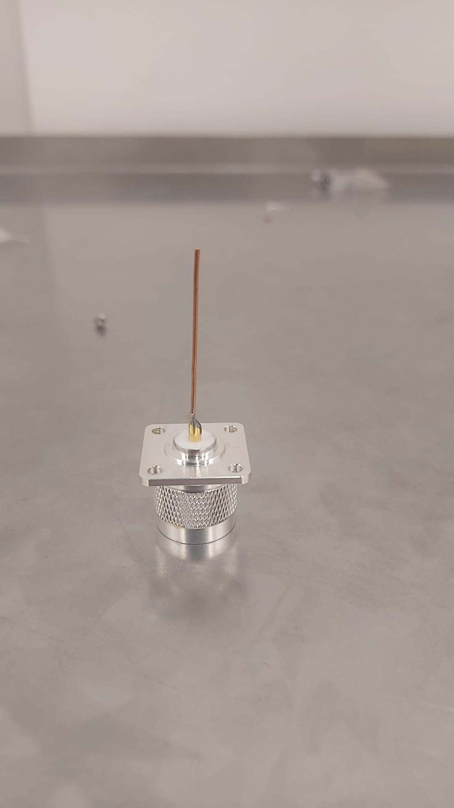
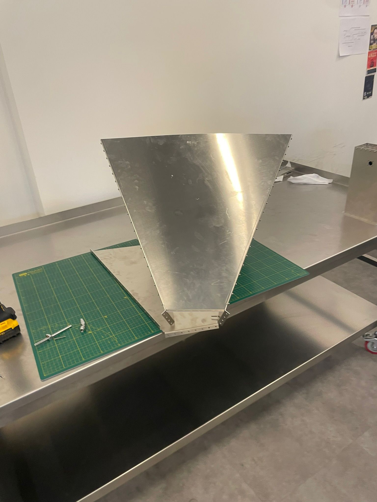
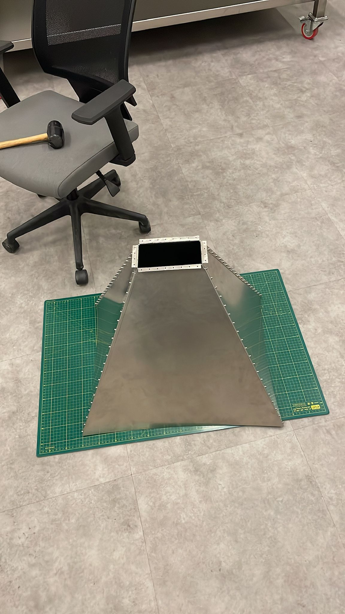
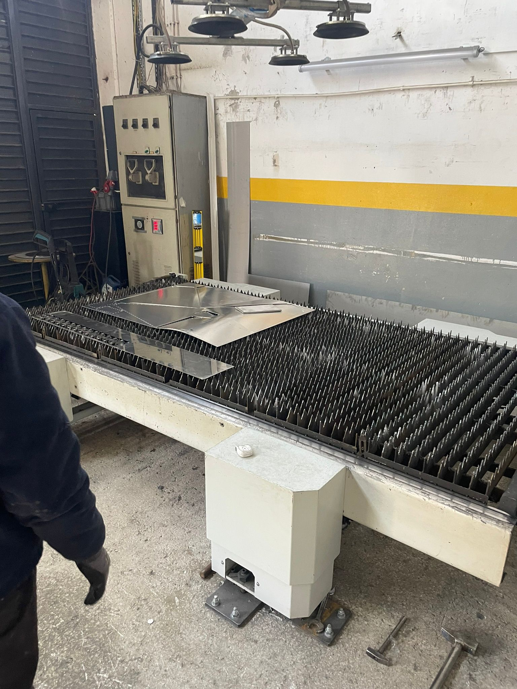
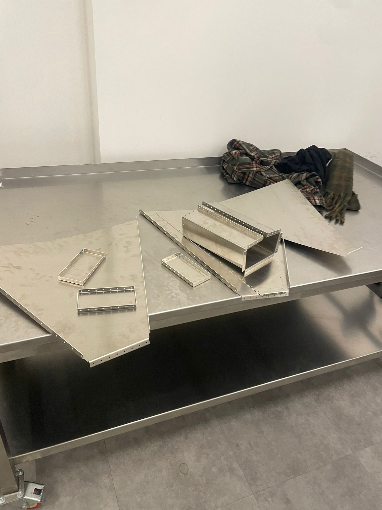
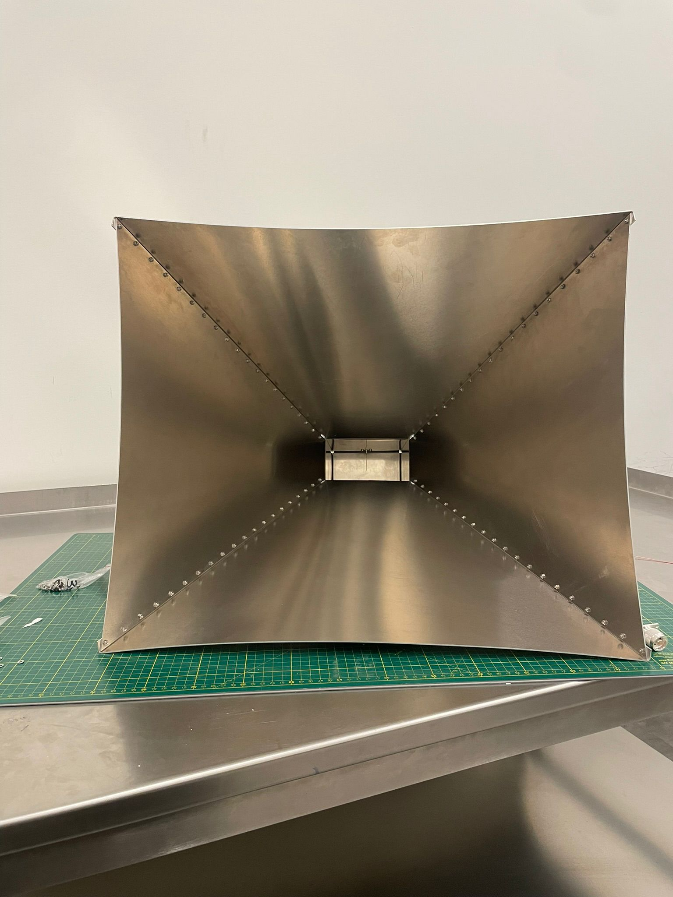
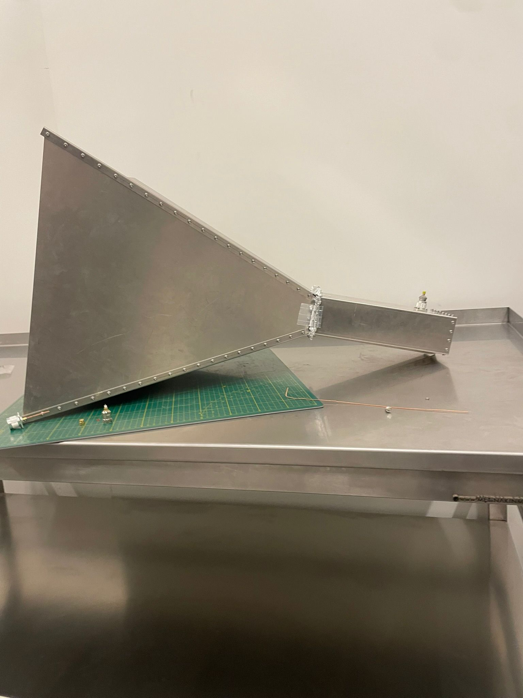
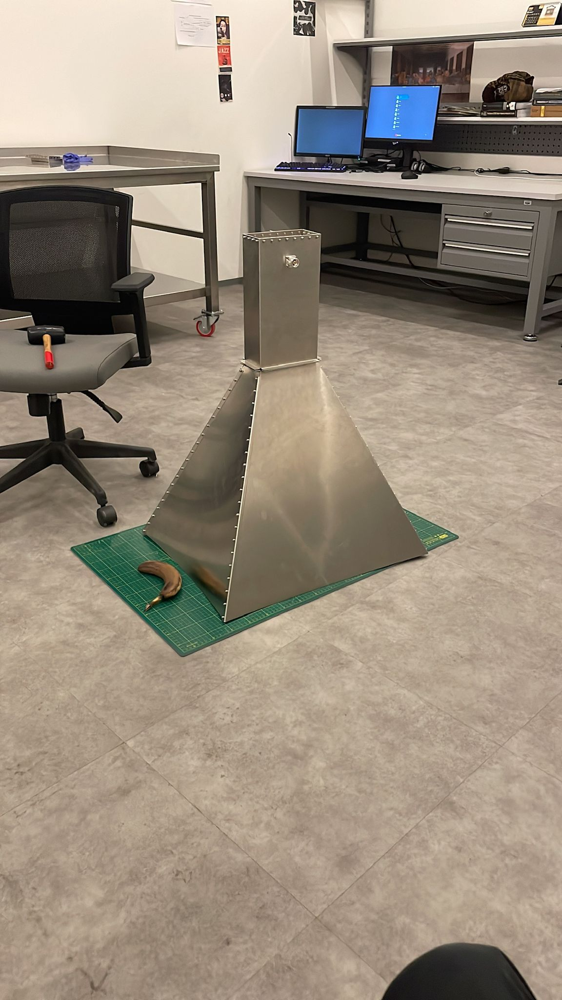

# Mergen-21 Antenna Assembly Guide

## Overview

This document provides complete assembly instructions for the Mergen-21 antenna. The assembly involves soldering the copper feed element to the N-type connector, followed by mechanical fastening of the antenna structure using M3 bolts with spring washers and nuts.

**Antenna Material:** Aluminum 5754, 1.5 mm thickness
**Waveguides:** Assembled separately (see separate documentation)
**Assembly Status:** Field-tested with documented manufacturing challenges (see Notes section)

---

## Tools Required

- Soldering iron (for initial copper wire attachment)
- Lighter or heat source (for isolation removal)
- 5.5 mm wrench/socket (M3 nut size) - **Note: difficult to source, consider M4 for future designs**
- Screwdriver (for bolt head if needed)
- Hammer (for straightening bent waveguide connectors, if needed)
- Measuring tape or calipers
- Safety glasses

---

## Bill of Materials (BOM)

### Connectors & Electrical Components

| Part | Description | Qty | DIN/Spec | Supplier | Notes |
|------|-------------|-----|----------|----------|-------|
| N-Type Connector | Amphenol RF 000-49000-SRFX | 1 | - | [Digikey](https://www.digikey.com/en/products/detail/amphenol-rf/000-49000-SRFX/4746416) | Main feed point |
| Copper Wire | 1.0 mm diameter, 38 mm length | 1 | - | Local/Supplier | Pure copper recommended |

### Fastening Components

| Part | Description | Qty | DIN | Material | Supplier |
|------|-------------|-----|-----|----------|----------|
| Bolt (Long) | M3 × 30 mm | 8-12 | DIN 965TX | Stainless Steel A2-304 | Local hardware store |
| Bolt (Final) | M3 × 8 mm | 8-12 | DIN 7985TX | Stainless Steel A2-304 | Local hardware store |
| Washer (Flat) | M3 flat washer | 8-12 | DIN 125 | Stainless Steel | Local hardware store |
| Spring Washer | M3 spring washer | 8-12 | DIN 127 | Stainless Steel | Local hardware store |
| Nut | M3 hex nut | 8-12 | DIN 934 A2-304 | Stainless Steel | Local hardware store |

**Note:** Exact quantity depends on antenna size and number of bolt holes. Count bolt holes in drawings and adjust accordingly.

### Structural Component

| Part | Description | Qty | Specification | Notes |
|------|-------------|-----|----------------|-------|
| Aluminum Sheet | Antenna body | 1 | 5754-H22, 1.5 mm thickness | See warnings about material quality |

---

## Assembly Sequence

### Phase 1: Feed Element Preparation

1. **Solder copper wire to N-type connector**
   - Prepare the copper wire: 1.0 mm diameter, 38 mm length
   - Clean the N-type connector solder point with flux
   - Solder the copper wire perpendicular to the connector contact point
   - Allow solder joint to cool completely
   - **Inspect:** Solder joint should be shiny and crack-free

2. **Remove wire insulation**
   - Carefully burn off all remaining insulation using a lighter
   - Work slowly to avoid damaging the copper wire
   - The wire should be bare copper after this step
   - Allow to cool

3. **Final inspection**
   - Verify copper wire is straight and properly soldered
   - Check that no insulation remains
   - Confirm wire dimensions: 1.0 mm diameter, ~38 mm length

**Figure 1.1:** N-type connector with soldered copper feed element

---

### Phase 2: Mechanical Assembly - Bolt Installation

#### Step 1: Initial Bolting with M3×30 Bolts

1. Insert M3×30 bolts into bolt holes (starting with multiple holes simultaneously)
2. For each bolt hole, assemble in this order (from antenna surface inward):
   - Bolt head (outside antenna)
   - Flat washer (DIN 125)
   - Spring washer (DIN 127)
   - Aluminum antenna wall
   - Aluminum antenna wall (second layer if applicable)
   - Nut (inside antenna) - **Note: nuts remain inside**

3. Thread approximately 4-6 bolts loosely - do not fully tighten yet
4. These long bolts serve as initial alignment and holding points

#### Step 2: Transition to M3×8 Bolts

1. Once initial long bolts are in place and holding the structure:
   - Remove one M3×30 bolt
   - Replace with M3×8 bolt (same washer stack configuration)
   - Repeat for remaining bolts in a cross-pattern (to maintain even pressure)

2. Replace all M3×30 bolts with M3×8 bolts in this sequence:
   - This prevents distortion of the antenna structure
   - Ensures even clamping pressure

#### Step 3: Final Tightening

1. Once all bolts are M3×8, perform final tightening
2. Tighten in a cross-pattern (opposite sides alternately)
3. Do not over-tighten - stop when resistance is felt
   - **Recommended torque:** 0.5-1.0 Nm (if torque wrench available)

#### Step 4: Installation of N-Type Connector and Feed

1. Mount the prepared N-type connector with soldered copper feed element
2. Secure to antenna according to connector mounting design
3. Verify copper feed element is aligned with antenna aperture

**Figure 2.1:** Horn antenna assembly showing bolt pattern and N-type connector integration

**Figure 2.2:** Finished horn with N-type waveguide connector

---

## Assembly Notes & Warnings

### ⚠️ Manufacturing Issues Encountered

During assembly of this antenna, the following manufacturing challenges were documented:

**Figure 3.1:** Laser cutting equipment used for antenna components

**Figure 3.2:** All antenna parts after laser cutting and bending

1. **Waveguide Bending Problem**
   - Issue: Laser cutting and bending service misunderstood specifications
   - Result: H-plane and E-plane waveguide connectors were bent 90° less than specified
   - Solution: Straightened connectors using a hammer
   - Lesson: Verify bending angles with manufacturer before production
   - **Recommendation for next design:** Provide detailed bending diagrams and angle tolerances

2. **Aluminum Material Quality**
   - Issue: Supplier provided aluminum sheet with slight concave deformation
   - Cause: Cost-cutting measure (unclear if steel contamination or poor annealing)
   - Impact: Caused assembly misalignment and uneven bolt clamping
   - **Recommendation:** Specify material flatness tolerance (±0.5 mm over 200 mm) and request surface verification

### ⚠️ Assembly Best Practices

1. **Wrench Size Issue**
   - M3 nuts require 5.5 mm wrench - this is **difficult to source**
   - Many standard wrench sets do not include 5.5 mm size
   - **For next iteration:** Consider upgrading to M4 bolts and nuts (common 6 mm wrench readily available)

2. **Spring Washer Orientation**
   - Always place spring washer AFTER flat washer (next to bolt head)
   - This protects the antenna surface from spring washer edge marks

3. **Nut Access**
   - Design accounts for nuts remaining inside antenna
   - Ensure adequate interior access before assembly
   - Do not over-tighten - stainless steel can seize if forced

4. **Material Flatness Check**
   - Before assembly, verify aluminum sheet is flat using straightedge
   - If material is warped, address before bolting (pressing/hammering if necessary)

---

## Recommended Design Improvements for Next Iteration

Based on assembly experience, the following modifications are recommended:

1. **Upgrade to M4 Fasteners**
   - Use M4×30 and M4×8 bolts instead of M3
   - Use DIN 934 M4 nuts and DIN 125 M4 washers
   - Reason: 6 mm wrench is standard and widely available; 5.5 mm is not
   - Benefit: Easier assembly and maintenance by end-users

2. **Material Specifications**
   - Tighten aluminum flatness tolerance to ±0.5 mm maximum deviation
   - Request surface inspection report from supplier
   - Consider sourcing from dedicated aerospace-grade supplier
   - Confirm material is aluminum 5754-H22 (not steel with aluminum cladding)

3. **Manufacturing Process**
   - Provide detailed bending diagrams with angle tolerances (±1° maximum)
   - Request prototype verification before full production run
   - Include flatness check in final inspection

4. **Assembly Documentation**
   - Provide detailed assembly drawings with cross-sections
   - Include torque specifications for final assembly
   - Add photos of correct bolt orientation and washer stacking order

---

## Finished Assembly

The completed antenna after full assembly and testing:

**Figure 4.1:** Finished antenna - front view

**Figure 4.2:** Finished antenna - side profile

**Figure 4.3:** Finished assembly with scale reference (banana for size comparison)

---

## Storage & Maintenance

- Store bolts, washers, and nuts in anti-corrosion bags (they are stainless steel A2-304)
- Keep spare fasteners for field repairs (recommend 10-20% spare quantity)
- If assembly requires disassembly: remove bolts in reverse cross-pattern to prevent distortion

---

## References

- DIN 125: Flat washers
- DIN 127: Spring (lock) washers
- DIN 934: Hexagon nuts
- DIN 7985TX: Phillips pan head screws (used as bolts)
- DIN 965TX: Phillips countersunk bolts
- N-Type Connector: Amphenol RF 000-49000-SRFX
- Aluminum: EN 5754-H22 (AlMg3 alloy)

---

## Revision History

| Date | Version | Changes |
|------|---------|---------|
| 2026-03-29 | 1.1 | Added assembly photos and visual documentation |
| 2026-03-29 | 1.0 | Initial documentation with DIN specifications and assembly sequence |

---

**Document Author:** Mergen-21 Project
**Last Updated:** 2026-03-29
**Status:** Complete with manufacturing notes and photo documentation
**Assembly Photos:** 8 photos included in `assembly-photos/` folder